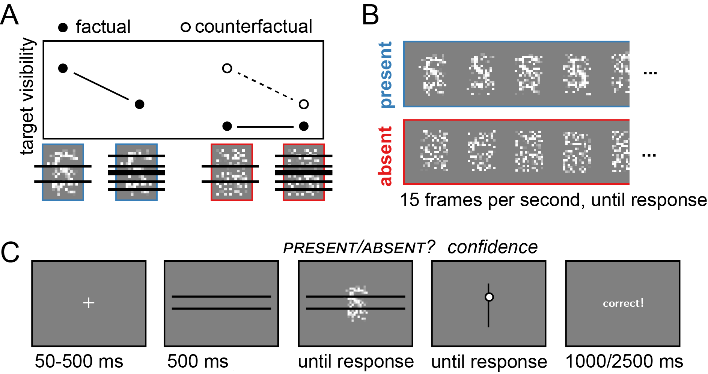

```{r setup, include = FALSE}
library('groundhog')
groundhog.library(
  c(
    'papaja', #for apa formatting
    'pwr', # for power calculation
    'tidyverse' # for pipe %>%
  ), "2024-01-01"
)

r_refs("r-references.bib")
knitr::opts_chunk$set(echo = FALSE)
```

```{r analysis-preferences}
# Seed for random number generation
set.seed(42)
knitr::opts_chunk$set(cache.extra = knitr::rand_seed)
```

# Motivation

This is why we thought it would be interesting to run this experiment.

# Methods

We report how we determined our sample size, all data exclusions (if any), all manipulations, and all measures in the study. <!-- 21-word solution (Simmons, Nelson & Simonsohn, 2012; retrieved from http://ssrn.com/abstract=2160588) -->

## Participants

The research complies with all relevant ethical regulations, and was approved by the Medical Sciences Interdivisional Research Ethics Committee at the University of Oxford (APPROVAL NUMBER HERE). Participants will be recruited via Prolific, and will give informed consent prior to their participation. To be eligible to take part in this study, their Prolific approval rate will need to be 95% or higher, their reported first language English, and their age between 18 and 60. We will collect data until we reach N included participants (after applying our pre-registered exclusion criteria). The entire experiment will take T minutes to complete. Participants will be paid £X for their participation, equivalent to an hourly wage of £9.

## Procedure

Description of procedure.

```{r design, echo=FALSE, fig.cap="Experimental design.", out.width = '75%'}

```

## Randomization

The order and timing of experimental events, as well as the luminance values of pixels within a trial, will be determined pseudo-randomly by the Mersenne Twister pseudorandom number generator, initialized in a way that ensures registration time-locking [@mazor2019].

# Data analysis

## Rejection criteria

Participants will be excluded if their accuracy falls below X%. We will also exclude participants for having extremely fast or slow reaction times in one or more of the tasks (below 100 milliseconds or above 5 seconds in more than 25% of the trials).

Trials with response time below 100 milliseconds or above 5 seconds will be excluded from the response-time analysis.

## Hypotheses and analysis plan

This study is designed to test THE MAIN THEORETICAL HYPOTHESIS IN ONE SENTENCE.

Hypothesis 1 (PRESENCE/ABSENCE RESPONSE TIME): We will test the null hypothesis that response times are similar for target-absent and target-present responses, aiming to replicate the finding that decisions about the absence of a target are slower than decisions about its presence. This will be tested using a paired t-test on the median individual level-response times.

Hypothesis 1 (HYPOTHESIS NAME): We will test the null hypothesis that []. This will be tested using a [] test on [].

## Sample size justification

With 250 participants, we will have a statistical power of `r pwr.t.test(n=250,d=0.3)$power%>%printnum()` to detect effect sizes of 0.3 standard deviations.

\newpage

References
